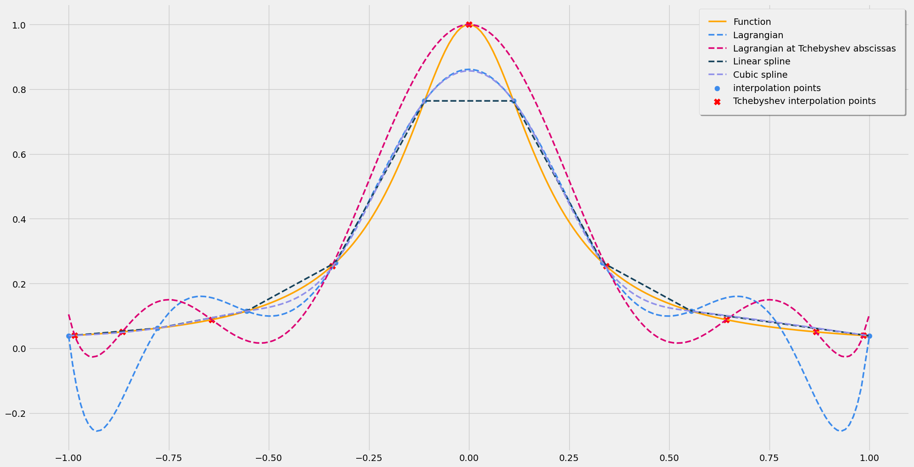
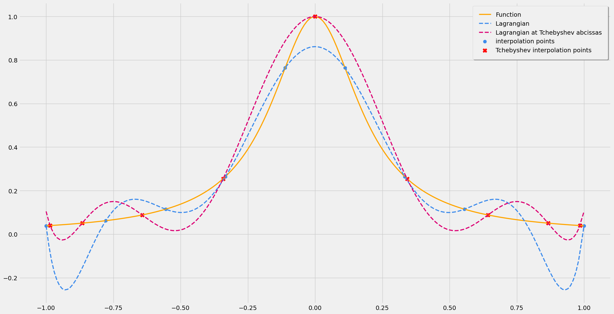
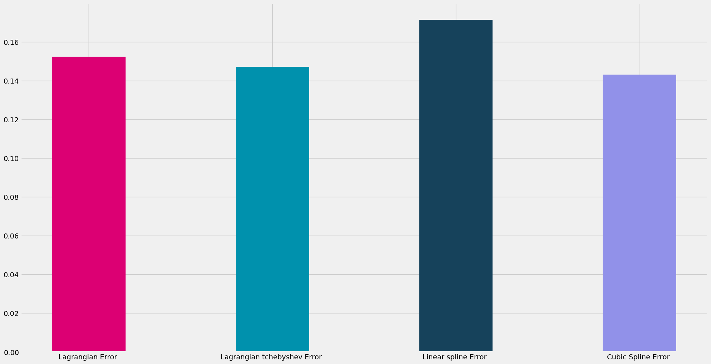

# Numerical Interpolation
<div align="left">

[]()
[](/LICENSE)

</div>

A Java project for performing numerical interpolations, featuring implementations of Lagrangian polynomial interpolation, linear spline interpolation, and cubic spline interpolation.

## Features

- **Polynomial**: A complete Polynomial management module.
- **Lagrangian Polynomial Interpolation**: Estimate values between known data points using polynomials.
- **Linear Spline Interpolation**: Piecewise linear approach ensuring continuity.
- **Cubic Spline Interpolation**: Piecewise cubic polynomial approach providing smoother transitions.
- **Integration Error**: Provide a method to evaluate interpolations error.

## Getting Started

### Prerequisites

- Java Development Kit (JDK) installed on your system. (version >= 17)

### Installation
Clone this repository:

```bash
git clone https://github.com/igorgreenigm/interpolation.git
```
Navigate to the project directory:
```bash
cd interpolation
```
You can compile directly the Java files:
```bash
javac src/*.java
```
Or, Open project with intelliJ IDE or directly import classes in your own project.

## Usage
To use this library in your project, include the provided classes. Detailed usage instructions and examples are available in the code comments.

The function $f$ used in the interpolation examples is defined as: $f(x) = \frac{1}{1 + 25x^2}$

### All interpolations


### Lagrangian + Tchebyshev interpolations


### Errors by interpolation
Error is computed using the formula $\sqrt{\int_a^b \left( f(x) - p(x) \right)^2dx}$  :

  - $f$ is the function to interpolate.
  - $p$ the interpolation polynomial (or set of polynomial for splines).
  - $[a, b]$ is the interval of distibuted samples.



## Contributing
- [IgorGreenIGM](https://github.com/IgorGreenIGM)
- [Willy Watcho](https://github.com/IgorGreenIGM)
- [Oliver Mokiage](https://github.com/IgorGreenIGM)
- [Natacha Fonkou](https://github.com/NatachaFonkou)
- [Audrey Mbeuyo]()
- [@FTZ]()
## License
This project is licensed under the MIT License - see the [LICENSE](LICENSE) file for details.

